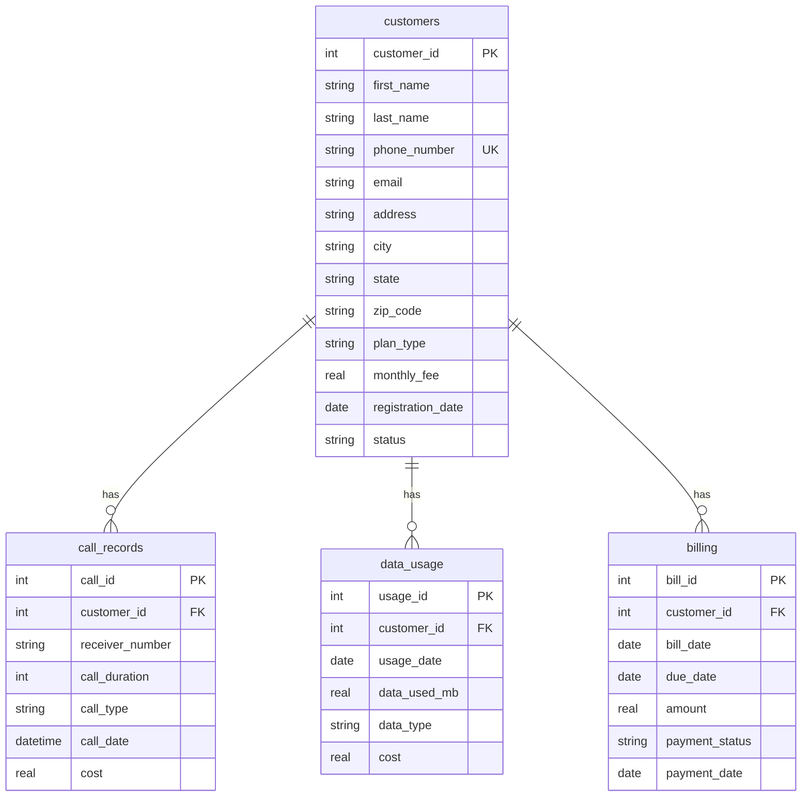
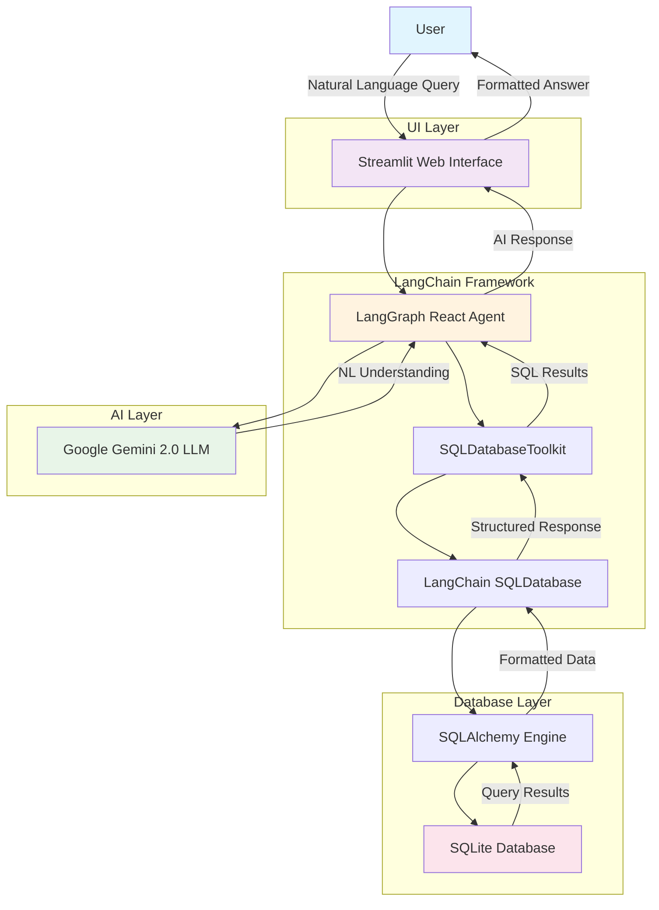

# 💬 Chat with Telecom DB - LangChain

A powerful conversational interface for querying telecom database using natural language. Built with LangChain, Google Gemini, and Streamlit, this application allows users to ask questions about telecom data in plain English and get intelligent responses backed by SQL queries.

## ✨ Features

- **Natural Language Querying**: Ask questions in plain English about telecom data
- **Intelligent SQL Generation**: Automatically converts natural language to SQL queries
- **Real-time Chat Interface**: Interactive Streamlit-based web application
- **Synthetic Data Generation**: Comprehensive telecom dataset with realistic data
- **Multi-table Support**: Queries across customers, call records, data usage, and billing
- **Google Gemini Integration**: Powered by Google's advanced language model

## 🗃️ Database Schema

The application includes a comprehensive telecom database with the following tables:

### Entity Relationship Diagram



### Customers
- Customer information (name, contact, address)
- Plan types (Basic, Premium, Family, Business, Student)
- Registration dates and account status

### Call Records
- Call details (duration, type, cost)
- Local, long distance, international, and mobile calls
- Call timestamps and receiver information

### Data Usage
- Data consumption tracking (4G, 5G, WiFi, Roaming)
- Usage dates and associated costs
- Data volume in megabytes

### Billing
- Monthly billing information
- Payment status and due dates
- Payment history tracking

## 🚀 Quick Start

### Prerequisites

- Python 3.8+
- Google API Key (for Gemini model access)

### Installation

1. **Clone the repository**
   ```bash
   git clone <repository-url>
   cd chatwithdb-langchain
   ```

2. **Install dependencies**
   ```bash
   pip install streamlit sqlite3 python-dotenv langchain langchain-community sqlalchemy langgraph faker
   ```

3. **Set up environment variables**
   Create a `.env` file in the project root:
   ```env
   GOOGLE_API_KEY=your_google_api_key_here
   ```

4. **Generate the database**
   ```bash
   python create.py
   ```
   This creates `telecom_data.db` with synthetic data:
   - 1,000 customers
   - 1,200 call records
   - 500 data usage records
   - 300 billing records

5. **Launch the application**
   ```bash
   streamlit run app.py
   ```

6. **Open your browser**
   Navigate to `http://localhost:8501` to start chatting with your database!

## 💡 Usage Examples

Try asking questions like:

- **Customer Analytics**
  - "How many customers do we have by plan type?"
  - "Who are our top 5 customers by monthly fees?"
  - "Show me inactive customers from California"

- **Call Analysis**
  - "What's the average call duration for international calls?"
  - "Which customers made the most expensive calls?"
  - "Show me call patterns by hour of day"

- **Data Usage Insights**
  - "What's the average data usage by plan type?"
  - "Who are our heaviest data users?"
  - "Compare 4G vs 5G usage costs"

- **Billing & Revenue**
  - "What's our total revenue this month?"
  - "How many customers have overdue bills?"
  - "Show me payment trends over time"

## 📁 Project Structure

```
chatwithdb-langchain/
├── app.py              # Main Streamlit application
├── create.py           # Database creation and data generation
├── main.py             # Example usage and testing
├── .env                # Environment variables (create this)
├── .gitignore          # Git ignore rules
├── README.md           # Project documentation
└── telecom_data.db     # SQLite database (generated)
```

## 🛠️ Technical Architecture

### System Architecture Diagram



### Core Components

- **LangChain**: Framework for building LLM applications
- **Google Gemini 2.0**: Advanced language model for query understanding
- **SQLDatabase**: LangChain's SQL database abstraction
- **SQLDatabaseToolkit**: Tools for SQL query generation and execution
- **LangGraph**: React agent for intelligent query planning
- **Streamlit**: Web interface for user interaction

### Data Flow

1. User inputs natural language question
2. LangGraph agent analyzes the question
3. SQL toolkit generates appropriate SQL query
4. Query executes against SQLite database
5. Results are formatted and presented to user
6. Conversation history is maintained

## 🔧 Configuration

### Environment Variables

| Variable | Description | Required |
|----------|-------------|----------|
| `GOOGLE_API_KEY` | Google API key for Gemini access | Yes |

### Database Configuration

The SQLite database is configured with:
- Connection pooling for thread safety
- Foreign key relationships between tables
- Indexed columns for optimal query performance

## 🎯 Advanced Features

### Custom Query Optimization

The system uses LangChain's SQL agent with:
- Top-K result limiting (default: 5)
- SQLite dialect optimization
- Intelligent table selection
- Query result caching

### Error Handling

- Graceful handling of invalid queries
- User-friendly error messages
- Automatic query retry mechanisms
- Database connection recovery

## 🧪 Testing

Run the example script to test basic functionality:

```bash
python main.py
```

This will execute a sample query and display the results in the terminal.

## 🚀 Deployment

### Local Development
```bash
streamlit run app.py
```

### Production Deployment
Consider using platforms like:
- Streamlit Cloud
- Heroku
- AWS EC2
- Google Cloud Run

## 📊 Sample Data Statistics

The generated database includes:
- **1,000 customers** across 5 plan types
- **1,200 call records** with realistic duration and costs
- **500 data usage entries** across different network types
- **300 billing records** with various payment statuses
- **Total: 3,000 records** for comprehensive testing

## 🤝 Contributing

1. Fork the repository
2. Create a feature branch (`git checkout -b feature/amazing-feature`)
3. Commit your changes (`git commit -m 'Add amazing feature'`)
4. Push to the branch (`git push origin feature/amazing-feature`)
5. Open a Pull Request

## 📝 License

This project is open source and available under the [MIT License](LICENSE).

## 🆘 Troubleshooting

### Common Issues

**Database not found**
- Ensure you've run `python create.py` to generate the database

**Google API Key errors**
- Verify your API key is set in the `.env` file
- Check that your Google Cloud project has the necessary APIs enabled

**Import errors**
- Install all required dependencies using pip
- Ensure you're using Python 3.8 or higher

**Streamlit won't start**
- Check that port 8501 is available
- Try running with `streamlit run app.py --server.port 8502`

## 🔗 Useful Links

- [LangChain Documentation](https://python.langchain.com/)
- [Streamlit Documentation](https://docs.streamlit.io/)
- [Google Gemini API](https://ai.google.dev/)
- [SQLite Documentation](https://www.sqlite.org/docs.html)

---

**Built with ❤️ using LangChain and Google Gemini**
